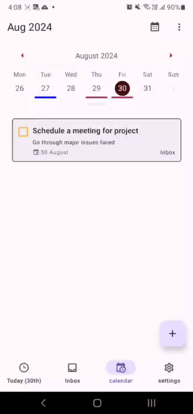

# CalenTrack

**Your ultimate task manager with a calendar-centric design.**

CalenTrack is a personal mobile task management app designed to place your calendar at the heart of your productivity workflow. With an intuitive interface and powerful features, CalenTrack streamlines task management for students and anyone in need of organization. The NLP-based task creation feature simplifies adding tasks by allowing you to use natural language commands, turning complex scheduling into a quick and effortless process.

## Background

CalenTrack is a final year project developed as part of UOL FYP curriculum. It was created to address the need for a calendar-centric task manager that combines advanced features like natural language date parsing and offline support with a user-friendly design. The project aims to demonstrate my skills in mobile development, backend integration, and real-time synchronization.

## Key Features

- **Calendar Views**:
  Choose from daily, weekly, or monthly calendar views to match your workflow. For example, use the daily view to focus on today's tasks or switch to the monthly view to plan ahead.

- **NLP based task creation**
  Quickly add tasks by typing commands like "Submit report next Friday at 10 AM" or "Review design by end of the week." CalenTrack will automatically recognize the date and time, so you don’t have to set them manually.
  
- **Real-Time Synchronization**:
  Stay connected and organized with real-time updates and synchronization across all your devices. Your tasks remain up-to-date and accessible, no matter where you are.
- **Offline Support with PowerSync and Kysely**:
  Continue managing your tasks even when you're offline. CalenTrack integrates PowerSync and Kysely, enabling seamless offline capabilities. Your changes are automatically synchronized once you're back online, ensuring your data is always up-to-date.

## Examples

### Today

  
*View of the Today tab, showing tasks for the current day.*

---

### Calendar Views

  
*Various calendar views available, including daily, weekly, and monthly.*

---

### Inbox

  
*Inbox screen displaying all current tasks.*

---

### Settings

  
*Settings screen where users can customize their preferences.*

## Frameworks

### Front-End

- **React Native with Expo**:
  We chose React Native for its ability to create high-performance mobile apps with a single codebase. Expo enhances development by offering powerful tools and services that simplify testing and deployment.

### Back-End

- **Supabase with PowersSync**:
  Supabase provides a scalable and easy-to-use backend solution with built-in authentication, database management, and real-time updates. PowerSync adds offline-first capabilities, ensuring that users can continue managing tasks even without an internet connection.

### Testing

- **Jest**:
  For unit testing and integration testing of the React Native components and logic. Jest provides a flexible and powerful testing framework that allows us to verify the functionality of our code with confidence.

- **Maestro**:
  For end-to-end (E2E) testing, ensuring that the entire application flow works as expected. Maestro allows us to simulate user interactions and test the app in real-world scenarios, providing an extra layer of validation.

## Installation and Setup for Development

1. This repository uses Yarn to install packages. Install Yarn with npm

```Node
  npm install --global yarn
```

follow these steps to set up your development environment:

1 **Clone the Repository**:

```Node
    git clone https://github.com/barnabas243/CalenTrack.git
    cd CalenTRACK
```

2 **Install Dependencies**:

```Node
    npx expo install
```

3 **Set Up Environment Variables**:

   Create a `.env` file in the root directory and add your environment variables:
  
  ```env
    EXPO_PUBLIC_SUPABASE_URL=your_supabase_url
    EXPO_PUBLIC_SUPABASE_ANON_KEY=your_supabase_anon_key
    EXPO_PUBLIC_SUPABASE_BUCKET=your_supabase_storage_bucket
    EXPO_PUBLIC_POWERSYNC_URL=your_powersync_url
   ```

4 **Run the Application**:

  ```Node
      npx expo prebuild
      npx expo run:android
  ```

5 **Start Exploring**: Access the app on your device or emulator and start exploring its features!

6 **Run tests**:
  
  ```bash
    yarn test
  ```

7 **open coverage report on browser**:

  ```bash
    yarn run view-coverage
  ```

## Roadmap

### Completed

- [x] **User Authentication with Supabase**: Manages secure user sign-ins and account management through Supabase.
- [x] **Google Sign-In**: Allows users to authenticate and access the app using their Google accounts.
- [x] **Basic Task Management (Add, Edit, Delete Tasks)**: Core functionality for managing tasks, including creation, modification, and removal.
- [x] **NLP-Based Task Creation**: Enables users to create tasks using natural language commands, simplifying task entry.
- [x] **Offline Mode with PowerSync**: Ensures that users can manage tasks without an internet connection, with automatic syncing when connectivity is restored.
- [x] **Implement Custom Themes**: Provides users with the ability to customize the app’s appearance according to their preferences.
- [x] **Integrate with Google Calendar API (READ ONLY)**: Syncs tasks with Google Calendar for a unified view of schedules and deadlines.
- [x] **Customizable Calendar Views**: Users can choose between daily, weekly, or monthly calendar views to match their workflow.
- [x] **Real-Time Synchronization**: Ensures that all devices are updated with the latest task information instantaneously.
- [x] **Task Prioritization and Sorting Options**: Allow users to prioritize and sort tasks based on different criteria, such as due dates or priority.
- [x] **Activity Log Screen**: Displays a history of user actions and task-related changes for better tracking and accountability.
- [x] **Retrieving Recurrence Options from Input**: Implement functionality to parse text input and extract recurrence rules for tasks.

### Planned

- [ ] **Add Recurring Task Support**: Implement functionality to handle tasks that repeat on a regular basis (e.g., daily, weekly).
- [ ] **Cross-Table Drag and Drop Feature**: Allows users to drag and drop tasks between different tables or categories for improved organization.
- [ ] **Task Chaining**: Allow users to create multiple or chain tasks so that the completion of one task automatically triggers or sets up the next task in the sequence.
- [ ] **Enhanced Notification System**: Introduce more advanced notification options and custom reminders to keep users informed.
- [ ] **Multi-language Support**: Add support for multiple languages to make the app accessible to a broader audience.
- [ ] **Improved Analytics Dashboard**: Develop a more detailed dashboard for analyzing task management and productivity trends.
- [ ] **Integration with Third-Party Task Management Tools**: Enable integration with other popular task management tools for better task synchronization.
- [ ] **Accessibility Enhancements**: Improve app accessibility features to support users with different needs and abilities.
- [ ] **In-App Tutorial and Onboarding Experience**: Offer a guided introduction to the app for new users to help them get started quickly and effectively.

## Support

If you encounter any issues or have any questions, feel free to reach out at [bttf243@gmail.com](mailto:bttf243@gmail.com).

## Acknowledgements

- **React Native**: For providing the framework that powers our app.
- **Expo**: For simplifying the development process.
- **Supabase**: For providing a robust backend solution.
- **powersync**:  For enabling offline capabilities with sqlite.
- **Kysely**: TypeScript-first query builder for simplified, type-safe SQLite queries.
- **Chrono-node**: For its library that facilitates natural date parsing.

## License

CalenTrack is licensed under the [MIT License](LICENSE).
